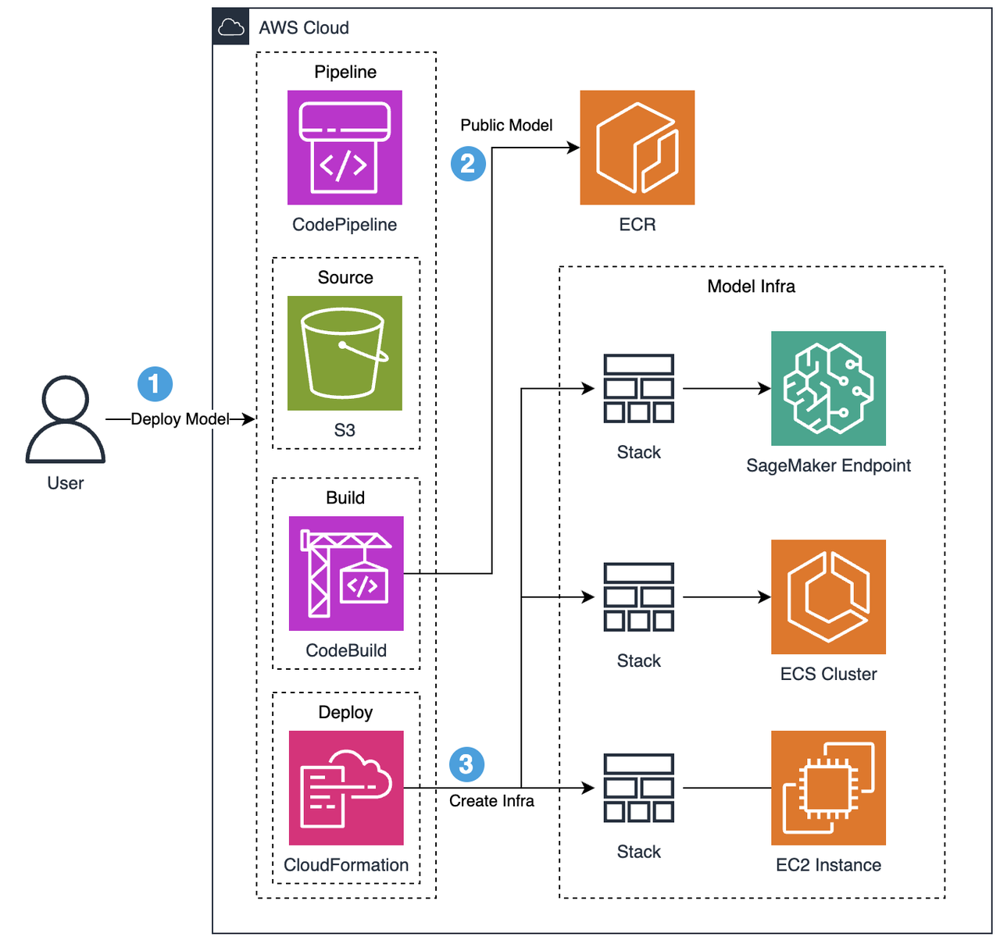

# Architecture

EMD deploys models to AWS using a simple three-step process:



1. User/Client initiates model deployment task, triggering pipeline to start model building.

2. AWS CodeBuild constructs the large model using predefined configuration and publishes it to Amazon ECR.

3. AWS CloudFormation creates a model infrastructure stack based on user selection and deploys the model from ECR to AWS services (Amazon SageMaker, EC2, ECS).

## Key AWS Services Used

- **CodePipeline**: Orchestrates the entire workflow
- **CodeBuild**: Builds model containers
- **CloudFormation**: Provisions infrastructure
- **ECR**: Stores model containers
- **Target Services**: SageMaker, EC2, or ECS hosts your model

EMD handles all IAM permissions and security configurations automatically.

## Model Deployment Cost Estimation

EMD leverages several AWS services to deploy models. Below is an estimated cost breakdown for deploying a single model (assuming a 5GB model file and 10-minute CodeBuild execution).

### US East (N. Virginia) Region Cost Estimation

| Service | Usage | Estimated Cost (USD) | Notes |
|---------|-------|----------------------|-------|
| **S3 Storage** | 5GB model file | $0.00/month | $0.023 per GB-month for standard storage. Free tier includes 5GB of S3 standard storage for 12 months |
| **CodeBuild** | BUILD_GENERAL1_LARGE for 10 minutes | $0.10 | $0.005 per build-minute |
| **CodePipeline** | 1 pipeline execution | $0.00 | First pipeline is free, then $1.00 per active pipeline/month |
| **CloudFormation** | Stack creation | $0.00 | No charge for CloudFormation service |
| **ECR** | ~2GB Docker image | $0.10/month | $0.10 per GB-month for private repository storage |
| **Total Deployment Cost** | | **$0.10** + $0.10/month | One-time deployment cost + monthly storage |

#### Target Service Costs (Post-Deployment)

- **SageMaker**: ml.g4dn.xlarge: ~$0.736/hour
- **EC2**: g4dn.xlarge: ~$0.526/hour
- **ECS**: Fargate or EC2 costs for container hosting
- **Secrets Manager**: $0.40/month for API key storage

### China North (Beijing) Region Cost Estimation

| Service | Usage | Estimated Cost (CNY) | Notes |
|---------|-------|----------------------|-------|
| **S3 Storage** | 5GB model file | ¥0.00/month | ¥0.21 per GB-month for standard storage. Free tier includes 5GB of S3 standard storage for 12 months (verify availability in China regions) |
| **CodeBuild** | BUILD_GENERAL1_LARGE for 10 minutes | ¥0.80 | ¥0.08 per build-minute |
| **CodePipeline** | 1 pipeline execution | ¥0.00 | First pipeline is free, then ¥7.00 per active pipeline/month |
| **CloudFormation** | Stack creation | ¥0.00 | No charge for CloudFormation service |
| **ECR** | ~2GB Docker image | ¥0.84/month | ¥0.42 per GB-month for private repository storage |
| **Total Deployment Cost** | | **¥0.80** + ¥0.84/month | One-time deployment cost + monthly storage |

#### Target Service Costs (Post-Deployment)

- **SageMaker**: ml.g4dn.xlarge: ~¥6.18/hour
- **EC2**: g4dn.xlarge: ~¥4.42/hour
- **ECS**: Fargate or EC2 costs for container hosting
- **Secrets Manager**: ¥3.36/month for API key storage

> **Note**: All prices are estimates as of 2024. Actual costs may vary based on your specific AWS region, usage patterns, and any applicable discounts. We recommend using AWS Cost Explorer to monitor and forecast your actual costs.

## Security Considerations

### API Key Authentication

EMD supports API key authentication for securing access to your deployed models:

#### Setting Up API Keys

**Using Command Line:**
```bash
emd deploy --model-id <model-id> --instance-type <instance-type> --engine-type <engine-type> --service-type <service-type> --extra-params '{
  "service_params": {
    "api_key": "your-secure-api-key"
  }
}'
```

**Using Interactive CLI:**
When prompted for "Extra Parameters" during `emd deploy`, enter:
```json
{
  "service_params": {
    "api_key": "your-secure-api-key"
  }
}
```

#### Managing API Keys

- **Storage**: Keys are securely stored in AWS Secrets Manager
- **Access**: Keys can be retrieved from the AWS Secrets Manager console
- **Rotation**: Update keys periodically through Secrets Manager or by redeploying

#### Using API Keys

Include the API key in your requests to the model endpoint:
```bash
curl -X POST https://your-endpoint.com/v1/chat/completions \
  -H "Content-Type: application/json" \
  -H "Authorization: Bearer YOUR_API_KEY" \
  -d '{
    "model": "your-model-id/tag",
    "messages": [{"role": "user", "content": "Hello!"}]
  }'
```

With Python:
```python
import openai

client = openai.OpenAI(
    base_url="https://your-endpoint.com",
    api_key="YOUR_API_KEY"
)

response = client.chat.completions.create(
    model="your-model-id/tag",
    messages=[{"role": "user", "content": "Hello!"}]
)
print(response.choices[0].message.content)
```

### Security Best Practices

1. **Enable HTTPS**:
   ```
   # Create certificate in AWS Certificate Manager
   aws acm request-certificate --domain-name your-model-endpoint.com

   # Update ALB listener to use HTTPS
   aws elbv2 create-listener --load-balancer-arn <your-alb-arn> \
     --protocol HTTPS --port 443 \
     --certificates CertificateArn=<certificate-arn> \
     --ssl-policy ELBSecurityPolicy-TLS13-1-2-2021-06 \
     --default-actions Type=forward,TargetGroupArn=<target-group-arn>
   ```

2. **Rotate API keys regularly**:
   * Update keys in AWS Secrets Manager
   * Redeploy models with new keys or update existing keys

3. **Implement network isolation** when needed:
   * Deploy in private subnets with NAT gateway
   * Use VPC endpoints for AWS services
